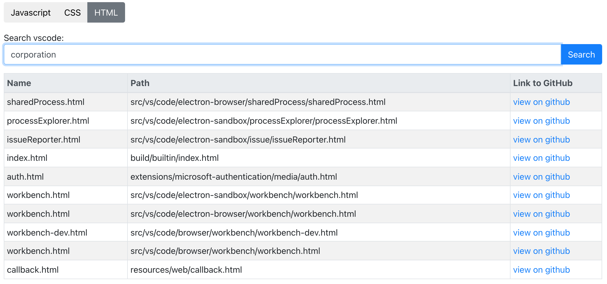
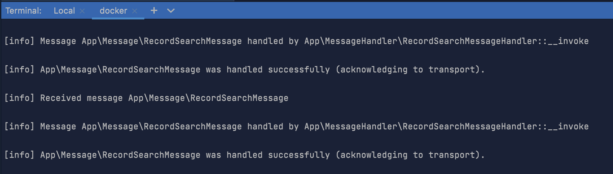
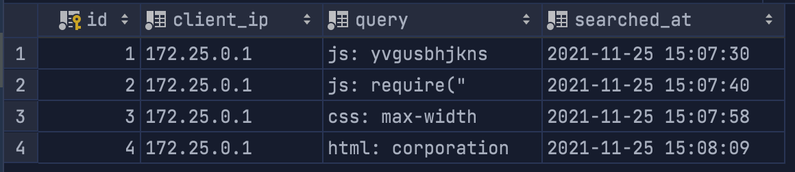

## Project: Search VSCode

### Setup instructions
The entire setup process has been distilled into a single file to make it easy for you to spin up the application and try it out. Run the following command in the project folder:

 ```bash
 chmod u+x setup.sh && ./setup.sh
 ```
- Frontend app will be available at [localhost:8088](localhost:8088)
- Backend app will be available at [localhost:8089](localhost:8089)

### Screenshots
Results displayed in frontend app


Message consumer (rabbitmq) responsible for asynchronously logging search history


Search history logs stored in sqlite db

